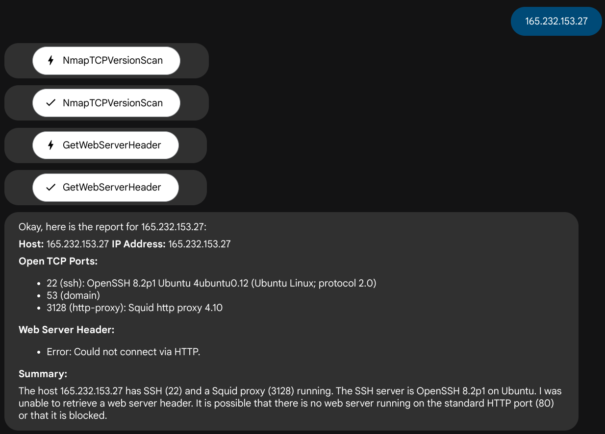

# aprober
An Agent based host prober - probe a host/ip using nmap/curl/etc and report back a human readable report.
* Primarily created to test the ease of using Google's ADK (Agent development kit).

## Setup
* Clone this repository
* Run init.sh or manually setup the python modules as needed
* This is using default config - if you want to change models you can follow instructions here - https://google.github.io/adk-docs/get-started/quickstart/#agentpy
* Under **aprobe** directory create a "**.env**" file with the following contents
  ```
  GOOGLE_GENAI_USE_VERTEXAI="False"
  GOOGLE_API_KEY="PUT_YOUR_GEMINI_KEY_HERE"
  ```


## How it works
* ADK [https://google.github.io/adk-docs/] - Agent development kit from Google allows one to create GenAI agents which can interact with each other to solve complex problems
* This version of aprober contains the following agents
  * NmapTCPVersionScan - Does nmap TCP scan and tries to get the server version
  * GetWebServerHeader - Uses curl to get HTTP response and guesses server name
  * GetSshServerVersion - Probes ssh server and extracts version info
* Its currently using Gemini 2.0 Flash (you need to get your own key) - but its expected to be model and platform agnostic

## How to run
ADK can be used over the web or using shell
* "adk web" creates a web server which you can interact using your browser
* Below is the output of a host I asked it to probe
  


